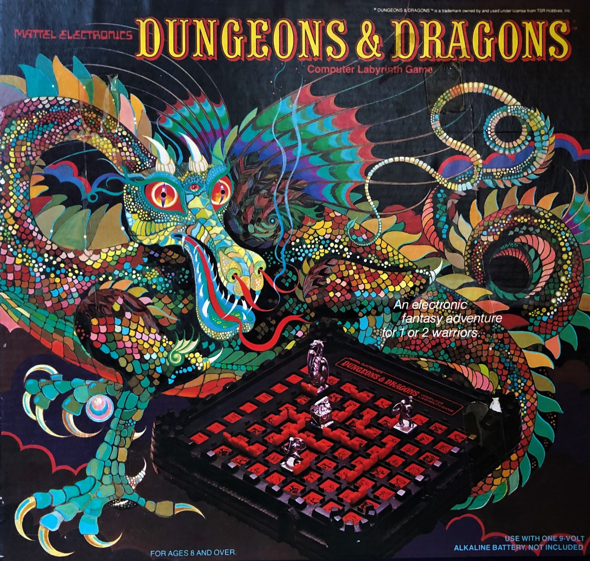

# Dungeons &amp; Dragons&trade; Computer Labyrinth Game Simulator

This game is a simulation of the Mattel Electronics&trade; Dungeons and Dragons&trade; Computer Labyrinth Game

Images of the game, the manual, game pieces, artwork and any audio are copyright of [Mattel](https://www.mattel.com/en-us)&trade;. Dungeons and Dragons&trade; is copyright of [Wizards of the Coast](https://company.wizards.com/)&trade;.

## Background
While browsing on Facebook I came across a post on a friend's feed about a 1980 Mattel Electronics&trade; Dungeons and Dragons&trade; Computer Labyrinth Game. At the time the game looked vaguely familiar but as I read through the post all the memories came back to me. I remembered owning this game when I was about 11 and being fascinated by it. Being a software developer I couldn't help but to try and recreate it. 

## Technical Info
This repo consists of an HTML5 page with a simulation of the game built on Javascript and CSS. It is entirely built in native Javascript so no other packages or libraries are required. The styles are also all written in native CSS so no SCSS/SASS compilers are needed. The HTML, styles and code are all unobfuscated and unminified as I use Cloudflare to perform the caching and minification.  

### Browser Support
All modern browsers running ECMAScript 2015 ES6 should be able to run the game. If the game detects that the Javascript `Promise` or `URL` objects do not exist it assumes the browser is not capable of supporting the game and alerts the user.

## Game Play
The original game required the user to place and move the game pieces but to make this simulation easier to play, I have the game pieces being placed and moved automatically. Time permitting I may add a "classic" mode later that would rely on the user to manually place and move all the game pieces to make it more like the original game. A [PDF User Manual](./assets/gameManual.pdf) describing the game is also included.

## Licensing

### MIT License

Copyright&copy; 2021 Bob Whitley

Permission is hereby granted, free of charge, to any person obtaining a copy of this software and associated documentation files (the "Software"), to deal in the Software without restriction, including without limitation the rights to use, copy, modify, merge, publish, distribute, sublicense, and/or sell copies of the Software, and to permit persons to whom the Software is furnished to do so, subject to the following conditions:

The above copyright notice and this permission notice shall be included in all copies or substantial portions of the Software.

THE SOFTWARE IS PROVIDED "AS IS", WITHOUT WARRANTY OF ANY KIND, EXPRESS OR IMPLIED, INCLUDING BUT NOT LIMITED TO THE WARRANTIES OF MERCHANTABILITY, FITNESS FOR A PARTICULAR PURPOSE AND NONINFRINGEMENT. IN NO EVENT SHALL THE AUTHORS OR COPYRIGHT HOLDERS BE LIABLE FOR ANY CLAIM, DAMAGES OR OTHER LIABILITY, WHETHER IN AN ACTION OF CONTRACT, TORT OR OTHERWISE, ARISING FROM, OUT OF OR IN CONNECTION WITH THE SOFTWARE OR THE USE OR OTHER DEALINGS IN THE SOFTWARE.
